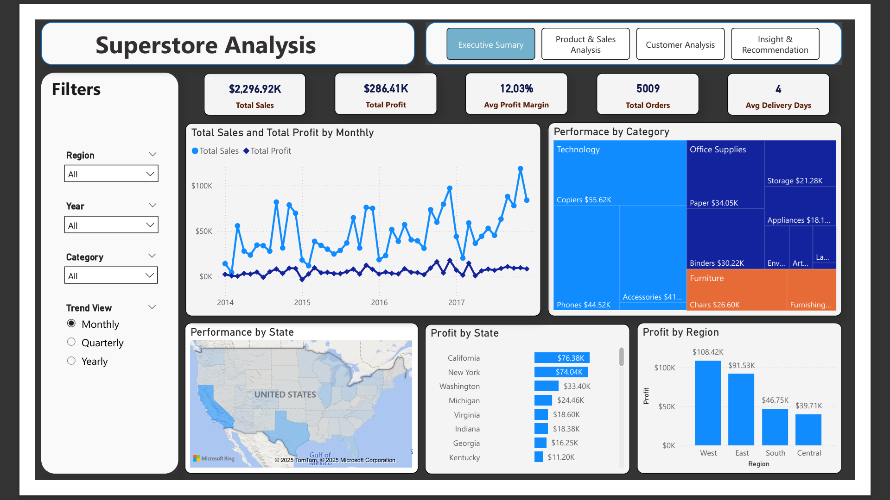
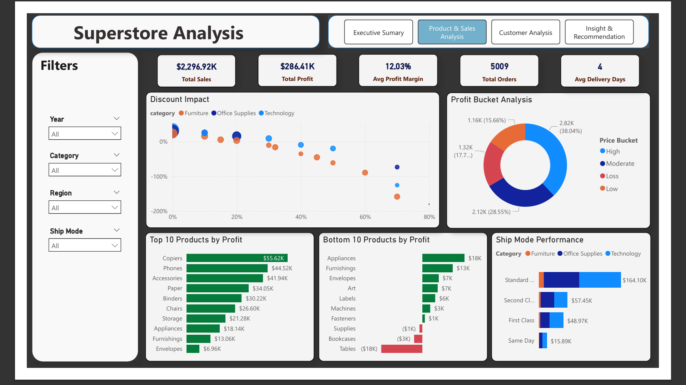
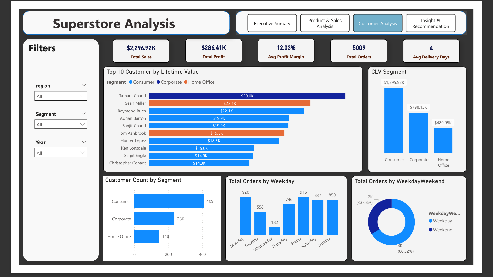
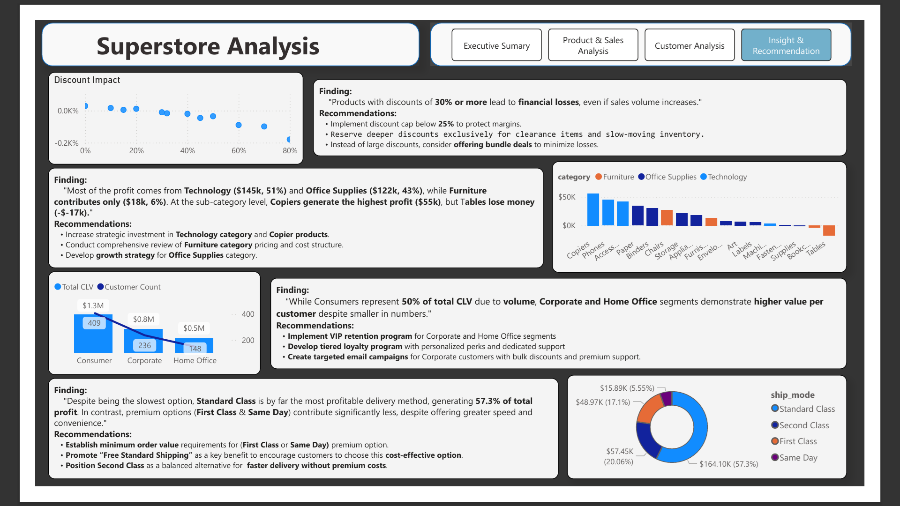

# Superstore Sales & Profitability Analysis
## 📊 Project Overview

An end-to-end data analysis project that transforms raw Superstore data into actionable business insights. This project demonstrates a complete ETL pipeline using Python for data processing, PostgreSQL for data storage, and Power BI for interactive dashboard creation.

---
## 📊 Dashboard Preview

### Executive Summary Dashboard

*High-level KPIs, sales and profit trends, and performance by category and region*

### Product & Sales Analysis

*Deep dive into discount impact, top/bottom products, and profitability analysis*

### Customer Analysis

*Customer Lifetime Value (CLV) segmentation and buying patterns*

### Insights & Recommendations

*Data-driven insights and strategic business recommendations*

**Alternative View:** [Download Full Dashboard PDF](docs/superstore-dashboard.pdf)

---
## 🎯 Business Objectives

- Analyze sales and profit trends across regions and product categories
- Identify impact of discounts on profitability
- Segment customers by lifetime value (CLV)
- Provide data-driven recommendations for business improvement

---
## 🛠️ Technical Stack

- **Data Processing:** Python (Pandas, NumPy)
- **Database:** PostgreSQL
- **Visualization:** Power BI
- **Data Source:** Kaggle Superstore Dataset

---
## 🔄 ETL Process

### Extraction
- Source: Kaggle Superstore dataset (manually downloaded)
- Format: CSV file with 9,994 records and 21 columns

### Transformation (Python Script)
The `superstore.py` performs comprehensive data cleaning and feature engineering:

**Data Quality Improvements:**
- Removed duplicate records
- Standardized data formats and categories
- Handled missing values

**Feature Engineering:**
- `Delivery Days`: Shipping duration calculation
- `Profit Margin`: Profit-to-sales ratio
- `Profit Bucket`: Categorization (High/Medium/Low Profit, Loss)
- `Discount Impact`: Correlation analysis between discounts and profitability
- `Customer Lifetime Value (CLV)`: Predictive customer value scoring
- Time-based features: Year, Quarter, Month, Weekday, Weekend Flag

### Loading (PostgreSQL)
- Cleaned data loaded into PostgreSQL database
- Optimized table structure for analytics
- Serves as single source of truth for Power BI

---
## 📈 Dashboard Architecture

### Design Philosophy: Consistent Context Across Operational Dashboards
A key design decision was maintaining core Key Performance Indicators (KPIs) across the three operational dashboards (Executive Summary, Product & Sales Analysis, and Customer Analysis), ensuring users always have business context regardless of which analysis page they're viewing.

#### Consistent KPI Header Includes:
- Total Sales
- Total Profit
- Average Profit Margin
- Number of Orders
- Average Delivery Time

### 1. Executive Summary
- Sales vs Profit trend analysis (with time hierarchy)
- Regional performance mapping
- Category profitability analysis
- Slicers: Year, Region, Trend View

### 2. Product & Sales Analysis
- Discount impact visualization (scatter plot)
- Top/Bottom 10 products by profitability
- Profit bucket distribution
- Shipping mode performance analysis
- Slicers: Year, Category, Region, Ship Mode

### 3. Customer Analysis
- Customer Lifetime Value segmentation
- Segment performance comparison
- Weekly buying patterns analysis
- Customer value tier analysis
- Slicers: Category, Year, Segment

### 4. Insights & Recommendations
- Four key business insights with supporting evidence
- Actionable recommendations for each finding
- Clean, focused narrative format
- Supporting visual evidence for each insight

---
## 💡 Key Insights & Recommendations

### 🎯 Insight 1: Discount Strategy Impact
**Finding:** Products with discounts of 30% or more lead to financial losses, even if sales volume increases.
**Recommendations:**
- Implement discount cap below 25% to protect profit margins
- Reserve deeper discounts exclusively for clearance items and slow-moving inventory
- Instead of large discounts, consider offering bundle deals to minimize losses.

### 📦 Insight 2: Product Category Performance
**Finding:** Most of the profit comes from Technology($145K, 51%) and Office Supplies ($122K, 43%), while Furniture contributes only ($18K, 6%). At the sub-category level, Copiers generate the highest profit ($55K) while Tables show significant losses (-$17K).

**Recommendations:**
- Increase strategic investment in Technology category and Copier products
- Conduct comprehensive review of Furniture category pricing and cost structure
- Develop growth strategy for Office Supplies category

### 👥 Insight 3: Customer Value Segmentation
**Finding:** While Consumers represent 50% of total CLV due to volume, Corporate and Home Office segments demonstrate higher value per customer despite smaller in numbers.

**Recommendations:**
- Implement VIP retention program for Corporate and Home Office segments
- Develop tiered loyalty program with personalized perks and dedicated support
- Create targeted email campaigns with bulk discounts for Corporate clients

### 🚚 Insight 4: Shipping Efficiency Analysis
**Finding:** Standard Class shipping generates 57.3% of total profit despite being the slowest option, while premium shipping methods (First Class & Same Day) contribute minimally to profitability.

**Recommendations:**
- Establish minimum order value requirements for premium shipping options
- Promote "Free Standard Shipping" as primary customer benefit
- Position Second Class as balanced alternative for time-sensitive deliveries
- Optimize logistics network for standard shipping efficiency

---
## 🚀 Installation & Setup

### Prerequisites
- Python 3.8+
- PostgreSQL 12+
- Power BI Desktop
- Git

### Installation Steps

1. **Clone repository**
   ```bash
   git clone https://github.com/AshFallen/superstore-analysis.git
   cd superstore-analysis
   ```

2. **Install Python dependencies**
   ```bash
   pip install -r requirements.txt
   ```

3. **Run ETL pipeline**
   ```bash
   python src/superstore.py
   ```

4. **Open Power BI dashboard**
   - Open `superstore_dashboard.pbix`
   - Refresh data connection to your PostgreSQL database

---
## 🤝 Contributing

1. Fork the project
2. Create your feature branch (`git checkout -b feature/AmazingFeature`)
3. Commit your changes (`git commit -m 'Add new feature '`)
4. Push to the branch (`git push origin feature/improvement`)
5. Open a Pull Request

---
## 📝 License

This project is licensed under the MIT License - see the [LICENSE.md](LICENSE.md) file for details.

---
## 👨‍💻 Author

**Jhon Kelly S. Romero**
- Email: romerojhonkelly@gmail.com
- GitHub: [@AshFallen](https://github.com/AshFallen)
